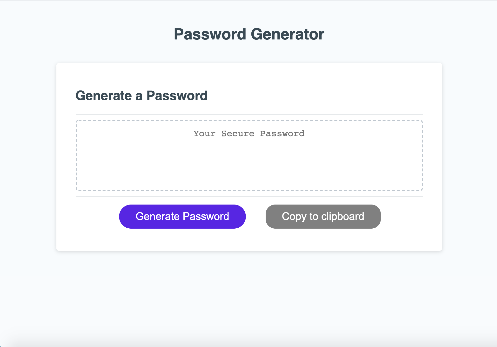

# TS-password-generator

## Description

## Contents of project
This project contains an index.html file, script.js file, and a style.css file. To view the project, click the link below.

## Acceptance Criteria
GIVEN I need a new, secure password
WHEN I click the button to generate a password
THEN I am presented with a series of prompts for password criteria
WHEN prompted for password criteria
THEN I select which criteria to include in the password
WHEN prompted for the length of the password
THEN I choose a length of at least 8 characters and no more than 128 characters
WHEN prompted for character types to include in the password
THEN I choose lowercase, uppercase, numeric, and/or special characters
WHEN I answer each prompt
THEN my input should be validated and at least one character type should be selected
WHEN all prompts are answered
THEN a password is generated that matches the selected criteria
WHEN the password is generated
THEN the password is either displayed in an alert or written to the page

## Satisfying acceptance criteria
To satisfy the first, I created a button in my html that, when clicked, would start the password generator script.

To satisfy the second, third and fourth, a series of prompts are used to determine exactly  which characters the user would like to use as well as how many character in the password are desired.

To satisfy the fifth, the character prompts are checked to see if all are false. If so, the questions are asked again. The password length prompt checks for input above or below a certain threshold as well as NaN, null, and inputs that are not numbers.

To satisfy the sixth, four character arrays are created with uppercase letters, lowercase letters, special characters, and numbers. Arrays to be included in password generation are pushed into an array.  A loop is run for the length of the password, and two random numbers are generated. The first random number chooses which character array will be used and the second chooses a random character from the selected array. The character is then concatenated into a password string variable.

[Link to deployed application](https://justpeachy8688.github.io/TS-password-generator)

